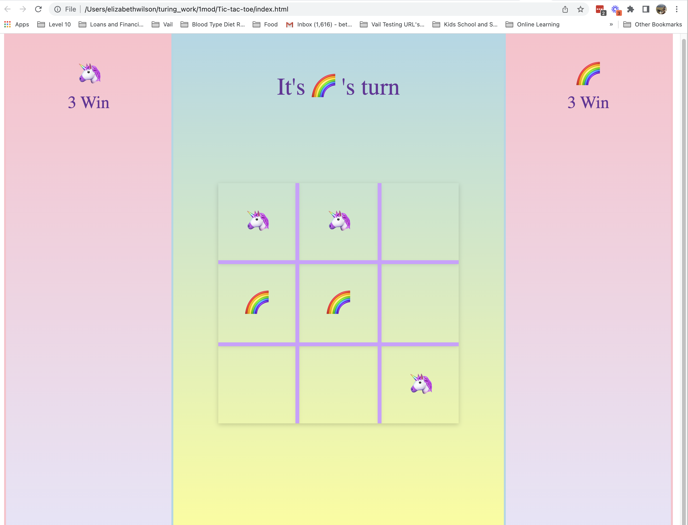

# Tic-Tac-Toe
## Table of Contents
 - [Introduction](#introduction)
 - [Technologies](#technologies)
 - [Features](#features)
 - [Illustrations](#illustrations)
 - [Deployed Page](#deployed-page)
 - [Possible Future Extensions](#possible-future-extensions)
 - [Set Up](#set-up)
 - [Organizational Resources](#organizational-resources)
 - [Sources](#sources)
 - [Contributors](#contributors)
 - [Project Specs](#project-specs)
## Introduction
 - In this project I worked on creating an engaging game of Tic-Tac-Toe, with the goal of writing clean DRY HTML, CSS and JS.  Using game logic, I iterated over winning number sets to match the Players selections, resulting in a win or draw.  
## Technologies
 - Javascript
 - HTML
 - CSS
## Illustrations
 
## Features
- Users are able to play a game of Tic-Tac-Toe and watch their scores increase on each win.
- Player turns will change on each game to allow players an equal amount of turns between games.
- The score columns will reflect the wins of each player.
- The main section will reflect the player's turn and if a player won or if it was a draw.
## Deployed Page
Visit my Tic-Tac-Toe game here! [here](url)
## Possible Future Extensions
 -  Adding local storage is a goal for a future extension.
## Set Up
1. Fork this repo
2. Clone the repo to your local machine
3. View the project in the browser by running open index.html in your terminal.
## Sources
 - [MDN](
 -[JavaTPoint](h
 -[YouTube](
 - [W3Schools](
## Contributors
 - [Beth](
## Project Specs
- https://frontend.turing.edu/projects/module-1/tic-tac-toe-solo-v2.html
